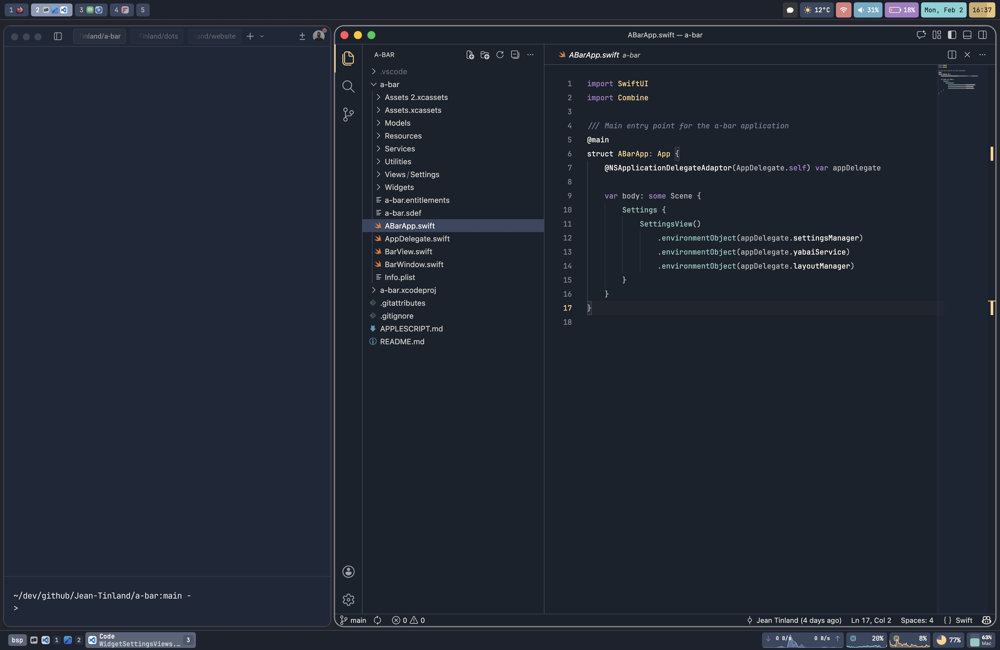

# 

Yet **a(nother) bar** :)

A native macOS menu bar replacement inspired by [simple-bar](https://github.com/Jean-Tinland/simple-bar), built with Swift and SwiftUI. It is a standalone recreation of simple-bar with a focus on performance, stability, and extensibility.

[Website](https://www.jeantinland.com/toolbox/a-bar) • [Documentation](https://www.jeantinland.com/toolbox/a-bar/documentation)

> [!CAUTION]
> Note of caution: Even in v1.x.x, a-bar stays in early development. Expect bugs, missing features, and breaking changes. Feedback and contributions are welcome!

## Features

- **Yabai Integration**: Full support for [yabai](https://github.com/koekeishiya/yabai) window manager
  - Display workspaces and processes with app icons
  - Click to switch spaces or focus windows
  - Rename, move, and manage spaces via context menu
  - Show/hide empty spaces
  - Sticky windows support
- **A handful selection of widgets**: 14+ widgets for system information and performance monitoring
- **Custom widgets**: Create your own widgets that reads data from `shell` commands or scripts
- **Theming, customization, and profiles**

[See all features in documentation](https://www.jeantinland.com/toolbox/a-bar/documentation/features/).

## Preview

## Backlog

You'll find all the bugs and list of planned features in the [GitHub backlog](https://github.com/users/Jean-Tinland/projects/2/views/1).

## Requirements

- macOS 13.0 or later
- [yabai](https://github.com/koekeishiya/yabai) (for window management features)
- [gh CLI](https://cli.github.com/) (optional, for GitHub notifications)

## Installation

You'll find the full installation guide in the [documentation](https://www.jeantinland.com/toolbox/a-bar/documentation/installation/).

Here's a quick summary:

1. Download the latest release from the [Releases](https://github.com/Jean-Tinland/a-bar/releases) page
2. Move `a-bar.app` to `/Applications`
3. As the app is not notarized you will need to do the following:
   - before launching the app for the first time: run the following command in Terminal: `sudo xattr -rd com.apple.quarantine /Applications/a-bar.app` then launch a-bar
   - after launching the app for the first time, you will need to: open `System Settings` > `Privacy & Security`, then click `Open Anyway` next to the a-bar warning
4. Grant necessary permissions when prompted

> [!NOTE]
> `xattr` command removes the quarantine attribute that macOS assigns to apps downloaded from the internet.

## Contributing

Contributions are welcome! Please read [CONTRIBUTING.md](CONTRIBUTING.md) for guidelines.

## License

GPL-3.0 license - see [LICENSE](LICENSE) for details.

## Credits

- Inspired by [simple-bar](https://github.com/Jean-Tinland/simple-bar)
- [yabai](https://github.com/koekeishiya/yabai) by koekeishiya
